# Restore wallet from Samourai Wallet without passphrase

If you have lost your passphrase, but still got your wallet in the Samourai Wallet app, here's how you can restore it on [Electrum Wallet](https://electrum.org/#download) or [Sparrow Wallet](https://sparrowwallet.com).

Note: if you have your seed words + passphrase, you can easily restore it on Sparrow. Refer to the [Sparrow Telegram group](https://t.me/sparrowwallet) and/or the [Samourai Telegram group](https://t.me/SamouraiWallet).  

**Beware: there are many scammers pretending to be admins and tech support fooling people in direct messages and stealing funds. DO NOT REPLY TO DMs!!**  

## Step 1: get xpub

Open Samourai Wallet and, under Settings > Wallets, open one xpub. You will have to do this for each xpub that contains funds. I will use **Segwit Zpub** as example:

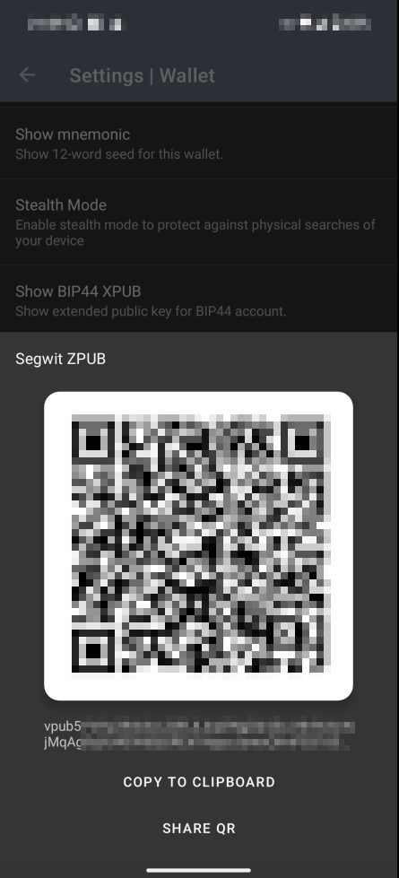

## Step 2: get one private key

With the xpub + one private key, we can get all private keys of that xpub.  
Go to Tools > Wallet address calculator and select the same **Address Type** as in the previous step. In this case, it's **BIP84 Segwit**. Leave Address Index as 0 and tap Address Details > Private Key:

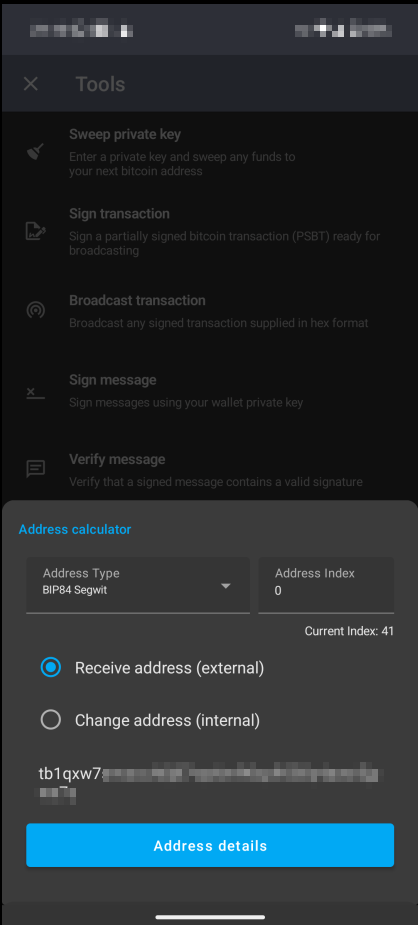

## Step 3: find the xprv

Now, download the files of this project. You can download them all, but the only required files are **index.html** and **bundle.js**.  
For your own safety, make sure you run it on a computer that is offline and/or you trust!  

Fill the xpub and private key fields with the values from steps 1 and 2, then click **Find xprv**. If you copied the right values, an xprv will be displayed for Electrum and an output descriptor for Sparrow.

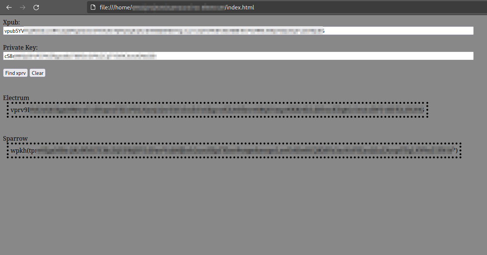

## Step 4: use the xprv or output descriptor

### Electrum

Open Electrum and create a new wallet. Choose **Standard Wallet** and **Use a master private key**:

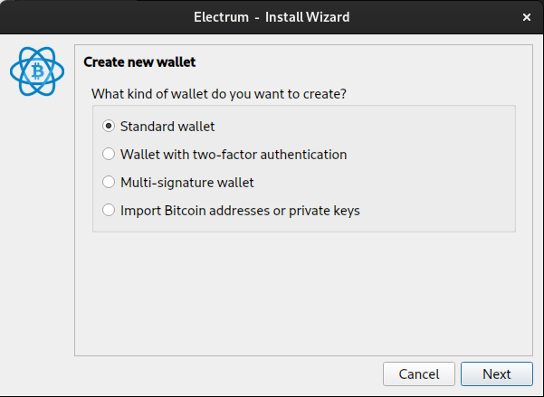 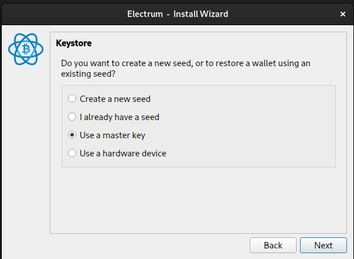

Then paste the xprv you got from this project:

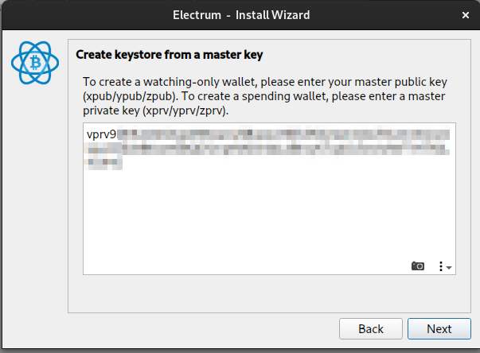

If everything went right, all the addresses and private keys of this xprv/xpub will be available:

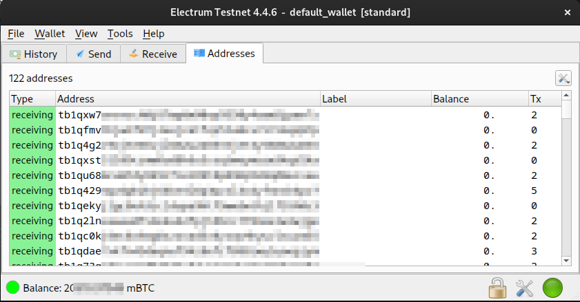

### Sparrow

Open Sparrow and create a new wallet. In the next screen, click **Edit**:

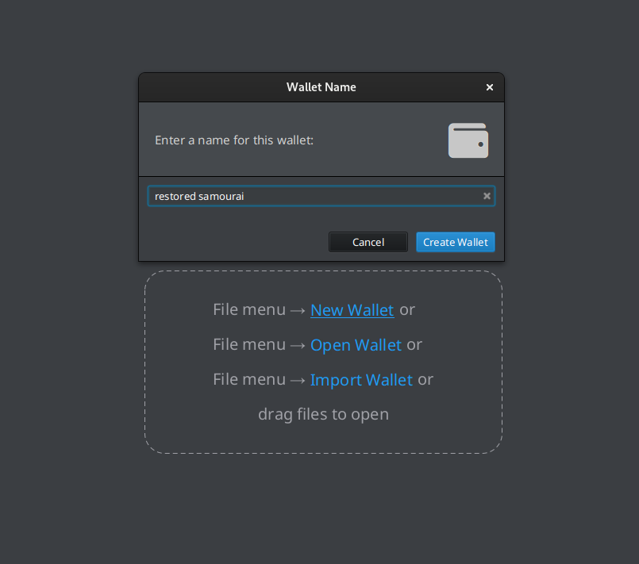 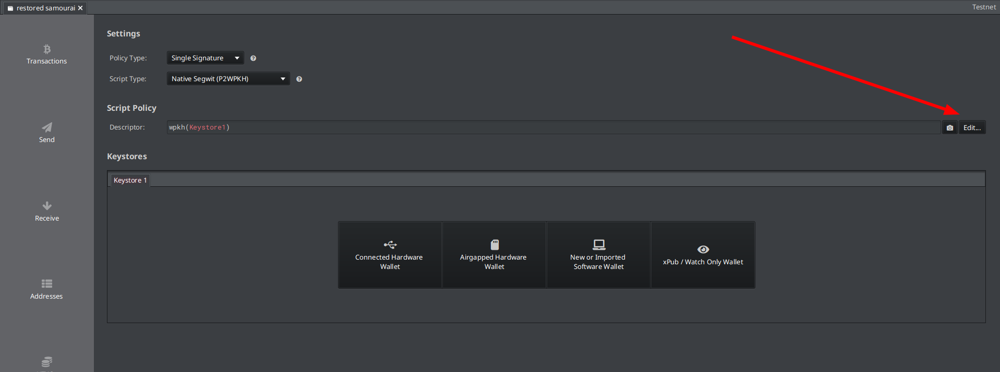  

Then, paste the output descriptor:  

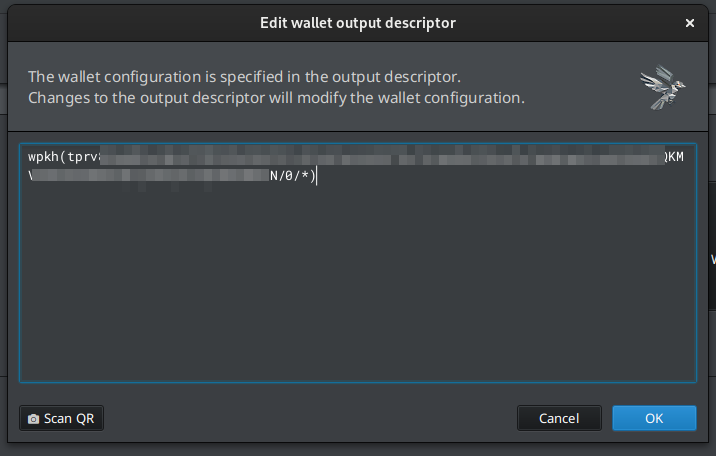  

If everything went right, the xprv/xpub will be restored:

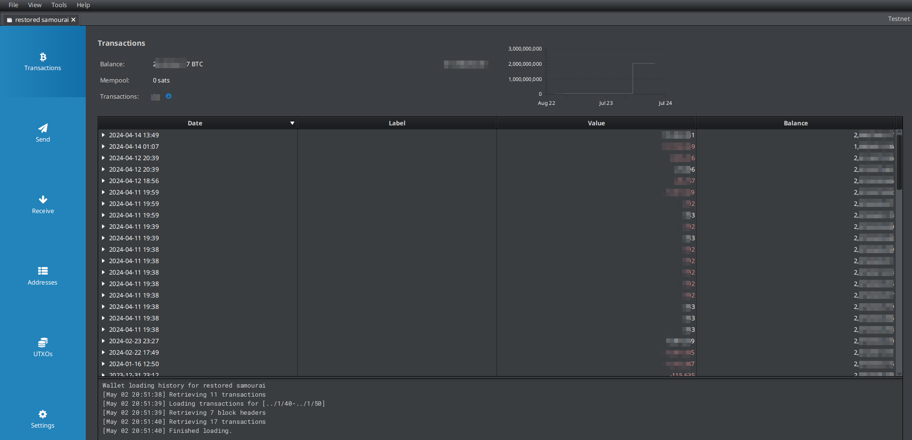  

## Step 5: repeat for the other xpubs

Go back to step 1 and perform the same steps for the other xpubs you have balance.